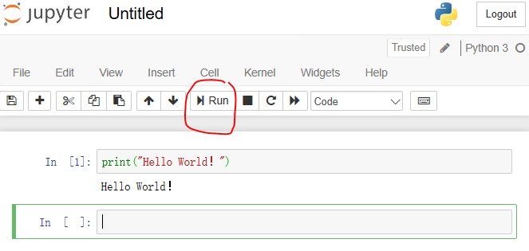

# PyML
Python / Machine Learning Tutorial

## Install Python Environment Anaconda3 on Windows

Download Anaconda3 from https://www.anaconda.com/distribution/

Select "Windows" It should show "Anaconda 2018.12 for Windows Installer"

Choose "Python 3.7 version" and click "Download" button. It will download "Anaconda3-2018.12-Windows-x86_64.exe"

The file size is about 614M.

Run the downloaded file to install Anaconda3

At the end of the installation, it will ask you if you want to install Microsoft VSCode (It is optional, if you have enough disk space, install it anyway)

## Start Jupyter Notebook

From Windows Start/Anaconda3 (64-bit) submenu, select "Jupyter Notebook"

It will open a page in your web browser (Microsoft Wdge or whatever browser is your default)

The Jupter Notebook starting page has three tabs： “Files", "Running", "Cluster"

In the "Files" tab, browse into a directory, which will be your python notebook working directory

In top right of the directory/files list pannel, there is a drop down box "New", click and choose Python 3 to create a python script

Type following in the input line "In []:"

  print("Hello World！")
  
Choose Run above the line, the output will print the string "Hello World！"

The python script has a default name ("Untitled"), to change it to something else, open File and select "Rename". Rename it as "JupyterHello". The file has "ipynb" as its file extention, which means "ipython(interactive python) notebook".

## Learning Python Basics using Jupyter Notebook

- [Python Basics 1](notebooks/pybasics01.ipynb)
- [Python Basics 2](notebooks/pybasics02.ipynb)
- [Python Basics 3](notebooks/pybasics03.ipynb)
- [Python Basics 4](notebooks/pybasics04.ipynb)
- [Python Basics 5](notebooks/pybasics05.ipynb)
- [Python Basics 6](notebooks/pybasics06.ipynb)
- [Python Basics 7](notebooks/pybasics07.ipynb)

## Useful Numerical Tools
- [numpy](notebooks/numtools01.ipynb)
- [matplotlib](notebooks/numtools02.ipynb)
- [pandas](notebooks/numtools03.ipynb)
- [scipy](notebooks/numtools04.ipynb)

## Machine Learning Basics

- [Machine Learning: scikit-learn](notebooks/machineslearning01.ipynb)
- [Machine Learning: tensorflow + keras](notebooks/machineslearning02.ipynb)
- [Machine Learning: pytorch](notebooks/machineslearning03.ipynb)

## Register GitHub Account and Install Git on Windows

### Register GitHub Account
GitHub is the largest open source code repository. One can register for free and use it to mange ones own source code. Any public repository is accessable to the public. One can also create private repository. The number of colabrorator in a private repository is limited to 3 for free account holder.

To register an GitHub account, one only need an email account.

One can just use a web brower to look and download files. However, to make the best of it, one should install a Git software on ones computer. One installed, a simple command such as

git clone https://github.com/johnzyin/PyML.git

can download all files in a repository to ones computer.

### Install Git on Windows

download from https://gitforwindows.org/

Depending on what is the latest verison, the file name will look like something as "Git-2.21.0-64-bit.exe". Run the file and install the program. During the installation, accept all default settings except the editor choices, choose "Nano" instead of the default "Vim" if you are not famuliar of Vim.

After installation complets, in Windows Start menu, there is a selection called "Git Bash" under Git submenu. Running Git Bash will give one a Unix like bash command window. Within this command window, one can issue git command to perform souce code management functions. 

### Basic Git Command

git clone 

git status

git add

git rm

git commit -m "comments"

git push

git pull

git stash

When push changes, it may happen that there are new changes at both sides (local and server), the merge comment can be edited in a
vim editor. The vim editor is the default editor of "Git for Windows" for some historical reasons. If one choses some other modern 
editor such as "Nano" during the installation of Git, one does not need to be bother with learning vim command keys.

In case of vim, forllowing is a quick note about some key command that maybe needed:

vim editor has two mode: intert and command.  Hit "Esc" key to switch from edit mode to command mode. Type "i" to switch from command mode to edit mode. In edit mode, use up/down/left/right arrow keys to move around, use backspace key to delete, type any thing for comment. In command model, use ":w" to write changes to disk and use ":q" to quit out from vi.

## Install PyCharm on Windows

Pycharm is an Pyhton IDE (Integrated Development Environment), VSCode is another IDE. An Python IDE has many advantages over Jupyter Notebook. It make debuging python programs much easier. It also has integration with source control system such as Git.

PyCharm can be downloaded from 

https://www.jetbrains.com/pycharm-edu/download/#section=windows

The latest free community version is called "PyCharm Edu".

